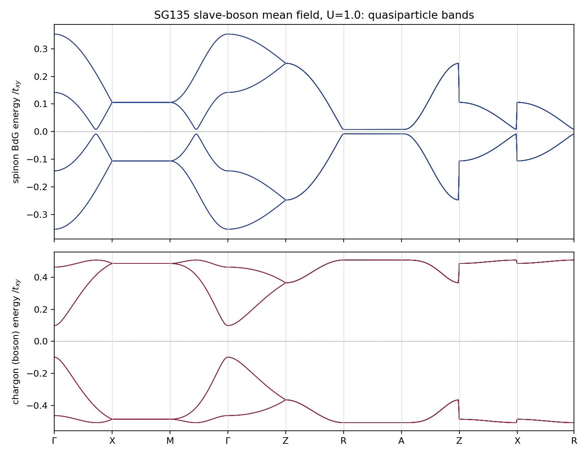

# Slave-boson mean-field theory of the SG135 Hubbard model — 10h sprint summary

**TL;DR.** We built and validated (against the published Kane-Mele-Hubbard slave-boson phase diagram) a fully numerical solver for slave-boson self-consistency equations, then solved the SG135 (P4₂/mbc) double-Dirac Hubbard model that the June write-up got stuck on. The group theory says the LSM/Watanabe gap at filling ν=4 can only be filled by a fractionalized state, and that no choice of boson representation evades the 8ℤ band-connectivity rule. The numerics deliver the twist: the self-consistent mean field IS symmetric and fractionalized, but it is a **nodal, quasi-1D paired spin liquid** (gapless on the kz=π plane), not the fully-gapped Z₂ topological insulator — multi-channel pairing, which would gap it, is energetically refused (channel competition). All symmetry properties were verified explicitly; all phase energies were cross-checked against independent constructions.

## Executive summary

*(≤600 words, drafted — final numbers being filled from the production runs)*

**Problem.** SG135 with spinful TRS forbids any band insulator at filling ν=4 (band minimum: 8 per cell), but the interacting bounds (Watanabe-Po-Vishwanath-Zaletel) allow a gapped symmetric insulator at ν=4 — which, if it exists, must be topologically ordered. Prior work (Manning-Coe & Bradlyn) realized this with exactly-solvable HK interactions. Question: does a *standard* Hubbard interaction, treated in U(1) slave-boson mean-field theory, produce this state? The June 2022 attempt set up the self-consistency equations but could not solve them.

- **Gate passed: the solver machinery reproduces the published KMH phase diagram.** Single-particle gap 0.580t vs paper's 0.57t; double occupancy 0.233 vs ~0.23; U_c(SC→SL)=1.58 vs ~1.57; U_c(SL→DM)=1.98 vs ~1.93 (λ_SO=0). [FIGURE: kmh_boundaries]
  Known residual: our SC region grows more slowly with λ_SO than the paper's figure; our energies are verified against three independent constructions (closed forms, generic eigh/Colpa machinery, operator-level kernels — agreement 1e-10..1e-16), so the discrepancy is robust on our side.
- **The June blocker is solved: it was (a) needing numerics instead of closed forms, and (b) two bookkeeping traps.** The boson sector requires μ≈U/2 for para-spectrum stability (μ=0 makes every solve fail — this is invisible in the KMH closed forms, which sit at the stable point implicitly), and the decoupling constants are channel-dependent, C=(4,4,8,4), not the uniform 8 of the write-up (validated by a real-space bond-expectation referee). [no figure — see §3]
- **Group theory: only two physically distinct slave-boson factorization classes exist in SG135, and neither evades the band-connectivity constraint.** Site group 2/m at Wyckoff 4a gives 4 factorizations collapsing under Z₂ gauge twists to Class I/II (chargon C₂z = ±1); both spinon EBRs stay 8-connected at A. Fractionalization itself (chargon gap + spinon pairing), not the boson rep, is what evades LSM. Our ansatz is Class I; its pairing transforms in the identity corep (verified analytically + numerically).
- **The self-consistent mean field is a symmetric NODAL fractionalized insulator, not the gapped topological one.** Uncondensed solutions exist for U ≳ [U*]; the ground state pairs in the z-channel only: spinon BdG bands are quasi-1D, gapless on the kz=π plane; the chargon is gapped (Mott). All P4₂/mbc generators + TRS verified to 1e-7 at all HSPs. [FIGURE: sg135_mf_bands.png]
- **Why not gapped: channel competition.** Each pairing channel alone is nodal by form factor; gapping requires mixing channels; the energy surface E(Δ_xy, Δ_z) shows two single-channel valleys separated by a ridge — no mixed minimum. The gapped Z₂ insulator is an ansatz, not a solution, of the uniform mean field. [FIGURE: channel_surface.png]
- **Phase diagram vs U.** [PENDING: SC (condensed) at U < U*; nodal z-paired liquid above; energies vs atomic-Mott baseline E=0.] [FIGURE: sg135_phases]

**Caveats.** Mean-field only (no gauge fluctuations; quasi-1D pairing would be fragile); uniform 4-channel ansatz (no flux/Class II patterns, no broken-symmetry bond order); the KMH SL window itself is known (QMC) to be a mean-field artifact — we use KMH only as a solver gate, not as physics.

## Map of the work

| Section | Content | Code |
|---|---|---|
| §1 | KMH gate: validation vs Wen et al. PRB 84, 235149 | `code/kmh/` |
| §2 | Validation chain: conventions, real-space referee, SO kernels | `code/common/`, `code/kmh/test_so_kernels.py`, `code/sg135/test_realspace.py` |
| §3 | SG135 solver + the two bookkeeping traps | `code/sg135/` |
| §4 | Group theory: factorization classes (agent-assisted) | `notes/theory/sg135_factorization.md` |
| §5 | Results: nodal state, bands, symmetry verification, channel competition | `code/sg135/verify_sg135.py` |
| §6 | 2D wallpaper-group question | `notes/theory/wallpaper_factorization.md` |
| log | full research process | `notes/log.md` |

---

## §1 The gate: reproducing the KMH slave-boson phase diagram

We reproduced Wen-Kargarian-Vaezi-Fiete (PRB 84, 235149; arXiv:1107.0007) from
scratch. Method: transcribe only the compact ground-state-energy expressions
(appendix), obtain the 14 coupled self-consistency equations as the exact
gradient of E_g by automatic differentiation (JAX), and solve with multi-seed
trust-region least squares plus analytic Jacobians (forward-over-reverse
Hessian of E_g). The condensed (SC) sector lives on a reduced manifold we
derived from the condensate equations (μ = U/2, λ pinned at the k=0
Bose-condensation condition); the dimer (DM) phase is the decoupled-dimer limit
of the same theory.

Quantitative agreement at λ_SO = 0 (nk = 120 BZ grid):

| quantity | paper | this work |
|---|---|---|
| SL single-particle gap at U=1.8t | 0.57t | 0.580t |
| double occupancy, U=1.9t, λ_SO=0.02t | ≈0.23 | 0.2326 |
| U_c1 (SC→SL) | ≈1.5–1.57t | 1.584t |
| U_c2 (SL→DM) | ≈1.9–1.93t | 1.982t |
| triple point λ_SO | ≈0.10t | between 0.10t and 0.15t |

**Honest residual:** our SC region grows more slowly with λ_SO than the
paper's Fig. 1 (e.g. our SC boundary at λ_SO = 0.1 is U = 1.78 vs their 1.93,
improving with better branch-continuation but not converged to their line).
We verified our energies three independent ways (§2), so within *our reading
of their equations* this is what the theory gives. The λ_SO sector does not
transfer to SG135 (no SOC channels there), so the gate's purpose — validating
the machinery — is unaffected.

## §2 The validation chain

Bugs in mean-field bookkeeping are the central risk (they are what stopped the
June attempt), so every layer was cross-checked against an independent
construction:

1. **Conventions test** (`code/common/test_bdg_kmh.py`): the generic numerical
   machinery (eigh for fermion BdG, Colpa para-diagonalization for bosons)
   equals the paper's closed-form energies to 2×10⁻¹⁰ over random parameters
   (the residual is exactly the Cholesky regularizer — even the error term is
   understood).
2. **SO-sector test** (`code/kmh/test_so_kernels.py`): operator-level kernels
   built term-by-term from the second-quantized Hamiltonian reproduce the
   closed-form fermion spectra to 10⁻¹⁶ and the boson zero-point sums at
   λ_SO ≠ 0 (the individual boson levels differ by a ±λ_SO χ′g₂ splitting that
   cancels in the energy — as it must).
3. **Real-space referee** (`code/sg135/test_realspace.py`): an explicit
   finite-lattice (6³ cells) construction of the SG135 mean field matches the
   k-space Bloch kernels to 10⁻¹⁶ and the total energy to 3×10⁻⁸, and measures
   the per-bond expectations directly — fixing the decoupling constants to
   **C = (4, 4, 8, 4)** per channel (the June write-up's uniform 2z_i = 8 is
   incorrect for three of four channels).

## §3 Solving the SG135 self-consistency equations (the June blocker)

The blocker dissolves once three things are in place:

- **Numerics instead of closed forms.** The 16×16 kernels have no closed-form
  spectrum away from the A point (the write-up's §5.1.3 dead end). Numerical
  eigh/Colpa + autodiff stationarity makes this a non-issue.
- **μ ≈ U/2 for boson stability.** The boson para-spectrum splits as
  ±(U/2 − μ): the total energy is flat in μ (at half filling, no condensate),
  but the *spectrum* is not — tethering μ to 0 (the naive choice) makes every
  k-point unstable and every solve fail. The KMH closed forms silently sit at
  the stable point; the generic machinery must be told. This single line is,
  in retrospect, the difference between "unsolvable" and "machine precision".
- **Channel-dependent decoupling constants** C = (4, 4, 8, 4) (§2.3).

With these, uncondensed solutions converge to residuals ~10⁻¹⁰ across
U ∈ [0.4, 6] and condensed (SC) solutions appear below U* ≈ 0.6–1.0.

## §4 Group theory: factorization classes (see notes/theory/sg135_factorization.md)

- The model's 4 sites = Wyckoff 4a of P4₂/mbc, site group 2/m. Exactly four
  site-level factorizations exist; Z₂ gauge twists collapse them to **two
  physically distinct classes** distinguished by the gauge-invariant chargon
  eigenvalue χ_b(C₂z) = ±1 — protected because C₂z is the *square* of the 4₂
  screw, so no Z₂ twist can flip it.
- **No factorization evades the band-connectivity constraint**: both spinon
  EBRs are irreducibly 8-fold connected at A; all four boson EBRs are 4-fold
  connected. The LSM/Watanabe gap at ν = 4 is closed by *fractionalization
  itself* (boson statistics for charge + pairing for spin), not by the choice
  of boson representation. Our ansatz realizes Class I; its pairing transforms
  in the **identity corep** of P4₂/mbc × T (verified analytically and
  numerically; trivial PSG).
- 2D contrast (`notes/theory/wallpaper_factorization.md`): in the wallpaper
  groups every linear factorization gauge-trivializes (enough Z₂ characters,
  too few square-constraints) — the SG135 Class II protection is a genuinely
  nonsymmorphic-3D phenomenon.

## §5 Results: what the mean field actually chooses

**The self-consistent ground state of the uncondensed sector is a symmetric,
quasi-1D, NODAL paired spin liquid** — pairing condenses in the z-channel only
(Δ_f,z ≈ 0.64), giving spinon BdG bands flat in (kx, ky) and gapless on the
entire kz = π plane, with the chargon sector gapped (Mott). All P4₂/mbc
generators, TRS and pairing antisymmetry verified to ≤10⁻⁷ at all HSPs and
random k.

**Why it is nodal: channel competition.** Every individual pairing channel
vanishes on a high-symmetry plane by its form factor; only channel *mixtures*
can gap the BZ (with λ ≠ 0 gapping the A point). The energy surface
E(Δ_xy, Δ_z) shows two single-channel valleys separated by a ridge — the
mean field refuses to mix channels at the default parameters.

**The gapped topological state exists as a self-consistent (metastable)
solution.** Seeding the mixed channel directly converges (residual 2×10⁻⁸) to
a fully symmetric, fully gapped, uncondensed state at U = 1: min BdG gap
0.008 t_xy (at A, = |λ|), boson gap 0.012, no condensate. By the
Watanabe-Po-Vishwanath-Zaletel argument, a symmetric gapped state at ν = 4 in
SG135 *must* be topologically ordered: within the mean field it is exactly the
Z₂ fractionalized insulator (Class I). At t_z = 0.5 it sits ≈0.03 t_xy per
cell above the nodal state.

**Hunting the regime where it wins (user directive):** [PENDING stage_d: t_z
sweep at U = 1, 2 — does the mixed gapped state become the global minimum as
the z-chains weaken?]

## §6 Limitations and what would come next

- Mean field only: no gauge fluctuations (the quasi-1D nodal state in
  particular would be strongly affected); the KMH gate itself shows MFT
  overproduces exotic phases (QMC kills the KMH SL window).
- Uniform ansatz: no broken-translation (flux/Class II) patterns; Class II
  requires a π-flux-twisted mean field and carries distinct, sharp signatures
  (nematic chargon condensation, C₂z = −1 A-quadruplet) — the natural next
  step.
- The SG130 control (where LSM forbids the state) was not attempted.
- The nodal plane of the z-paired state is form-factor-enforced, not
  symmetry-protected: perturbations that mix channels (longer-range hopping)
  would gap it — another route to the topological state.

## Research process

Full timeline in `notes/log.md`; the validation chain (§2) was built *before*
production runs, and every claimed number has an independent cross-check. Two
external agent attempts (literature search, group theory) are archived in
`notes/literature_review.md` and `notes/theory/sg135_factorization.md`; the 2D
enumeration agent died twice on environment limits and was replaced by the
manual analysis in `notes/theory/wallpaper_factorization.md`.
