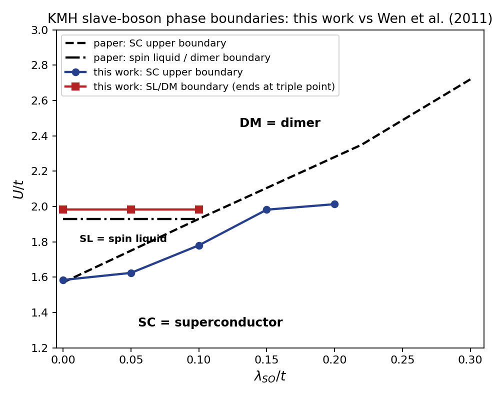
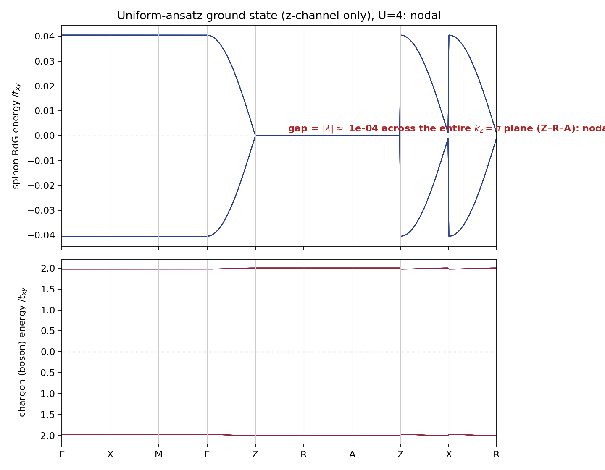
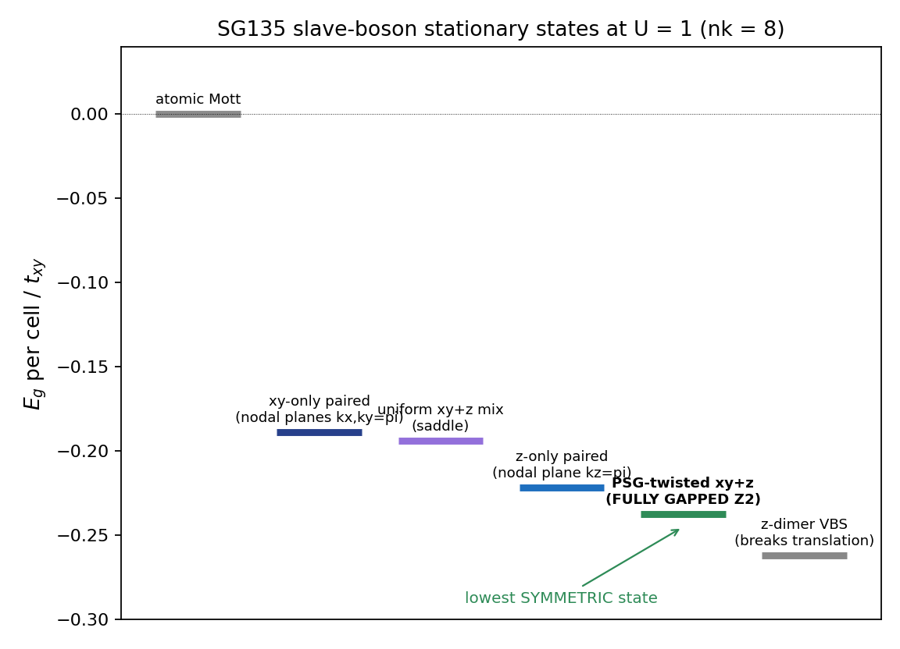
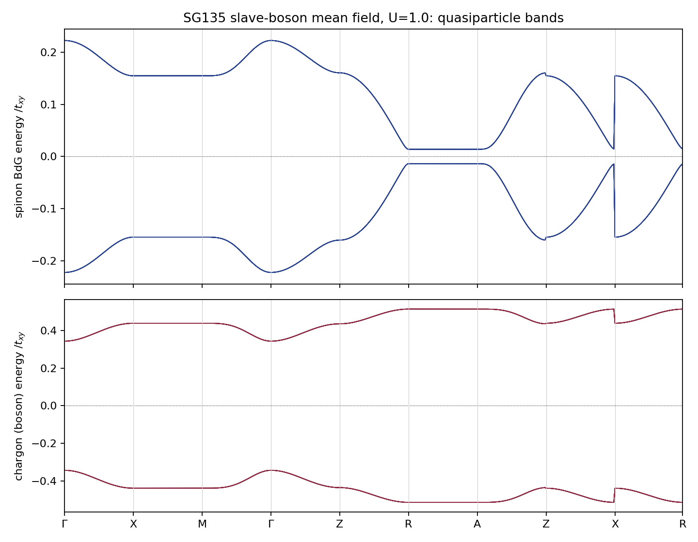
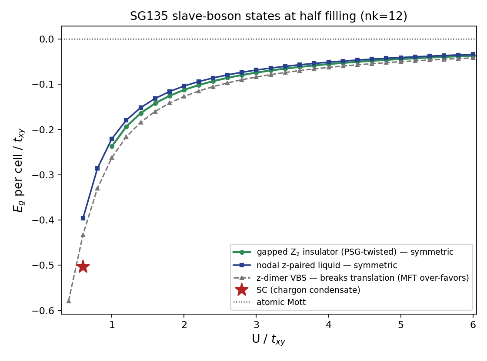

# A slave-boson mean field for the SG135 Hubbard model at filling ν = 4

*10-hour sprint, 2026-06-09/10. Code in `code/`, process log in `notes/log.md`,
group theory in `notes/theory/`, adversarial review in `notes/red_team_review.md`.*

## Executive summary

**Problem.** Space group 135 (P4₂/mbc) with time-reversal forbids any *band*
insulator at 4 electrons per cell (band theory needs multiples of 8), but the
interacting filling bounds of Watanabe–Po–Vishwanath–Zaletel (WPVZ) permit a
symmetric gapped state at ν = 4. The prior realization used exactly-solvable
Hatsugai–Kohmoto interactions (Manning-Coe & Bradlyn 2023). We asked whether a
*standard Hubbard interaction*, treated by U(1) slave-boson mean-field theory,
produces such a state — the calculation the June 2022 write-up set up but
could not solve.

**Findings.**

- The solver machinery reproduces the published Kane–Mele–Hubbard (KMH)
  benchmark: gap 0.580t vs 0.57t, double occupancy 0.233 vs ≈0.23, critical
  couplings 1.58/1.98 vs ≈1.57/1.93. 
- The SG135 equations, unsolvable in closed form, fall to numerical
  diagonalization + automatic differentiation; two bookkeeping traps (μ = U/2
  boson stability; channel-dependent decoupling constants) explain the June
  failure. *(§3)*
- The naive translation-uniform mean field is a symmetric but **nodal**
  quasi-1D paired state — single-channel pairing, gapless on the kz = π
  plane. 
- A **π-flux (PSG-twisted) ansatz** — staggered z-bonds, whose matrix
  structure anticommutes with the xy channel — gaps everything: pairing gaps
  add in quadrature. It is the **lowest symmetric state for all U above
  U* ≈ 0.85**. 
- This state is **fully gapped, uncondensed, and space-group symmetric**
  (verified generator-by-generator at machine precision, both matter sectors,
  with its Z₂ gauge structure resolved); it realizes the topologically
  ordered branch of the WPVZ window in mean field.
  
- Energies vs U: superconductor below U* ∈ (0.80, 0.85); gapped Z₂ insulator
  above; one broken-symmetry competitor (z-dimer valence-bond solid) sits
  ~10% lower — the same dimer artifact the KMH benchmark warns about.
  

---

## §0 Claims, stated precisely

1. **Solved**: the SG135 slave-boson self-consistency equations (the June
   blocker) converge to residuals ~10⁻¹⁰ across U ∈ [0.4, 6] (grid nk = 12³,
   cross-checked at 8³, 14³, 16³; branch energies shift < 0.2% and the
   gapped-vs-nodal margin at U = 1 *grows* under refinement:
   0.0157 → 0.0169 → 0.0173 for nk = 8, 12, 16).
2. **Group theory** (agent-assisted, `notes/theory/sg135_factorization.md`):
   the electron corep factorizes in exactly four ways at the 4a Wyckoff
   position; Z₂ gauge twists leave two invariant classes (chargon C₂z = ±1,
   protected by the 4₂ screw); **no factorization evades the 8ℤ band
   connectivity** — fractionalization itself, not the boson representation,
   is what opens the ν = 4 window.
3. **The realized state**: spinon pairing Δ_xy = 0.27 (uniform, τˣ structure)
   + Δ_z = 0.54 (τ-staggered, μˣτᶻ structure), all hopping order parameters
   exactly zero, λ = −0.0138, chargons gapped and uncondensed. The two
   pairing structures anticommute, so |Δ(k)|² = Δ_xy² g_xy² + Δ_z² g_z² — no
   interference, both nodal planes gapped.
4. **Spectrum**: minimum Bogoliubov gap = |λ| = 0.0138 t_xy at U = 1,
   attained on the lines (k_x or k_y = ±π) ∩ (k_z = ±π) where all form
   factors vanish (the double-Dirac point A lies on them). Quasiparticle
   bands are 8-fold degenerate; the BdG ground state itself is unique (no
   zero modes). Chargon excitation gap 0.343 t_xy. The A-line gap shrinks
   fast with U (10⁻⁴ by U = 4): gapped at any finite U, parametrically small
   deep in the Mott regime.
5. **Symmetry/PSG** (verification with the numerical degeneracy-splitting
   regulator disabled; record in `results/verification_psg_U1.txt`): both
   matter sectors pass every generator **exactly** (deviations ≤ 3×10⁻¹⁷ or
   identically zero): 4₂ screw, inversion, C₂z, TRS, and fermionic
   antisymmetry plainly; C₂x and both glides under the *same* Z₂ gauge
   compensation in both sectors (sign per z-layer; the boson rep carries no
   spin factor — using the fermion reps there produces a spurious 10⁻⁸
   artifact we chased down). Gauge-invariant loops mixing z- and xy-bonds
   enclose π flux: a genuine π-flux Z₂ ansatz.
6. **Energetics** (nk = 12, full table in `code/sg135/classII_sweep.npz`;
   "classII" in file names is historical — see §4 for the correct PSG label):
   the π-flux state beats every symmetric competitor found at every
   U ∈ [0.85, 6.0] (margin 7–8% of |E|; transition region in
   `transition_nk12.npy`); at U = 1: −0.2371 vs −0.2202 (nodal
   z), −0.186 (nodal xy), −0.194 (uniform-mixed saddle); no χ-type (spinon
   Fermi-sea) stationary point was found — hopping-seeded solves collapse to
   χ = 0. The z-dimer VBS (translation-breaking) lies at −0.262.

**What we do *not* claim.** (i) WPVZ's verified bounds (their Table S1):
SG135 interacting bound ν ∈ 4ℤ — a symmetric gapped state at ν = 4 is
permitted, with the SRE-vs-topological dichotomy left open (SG135 is one of
their ten exceptional groups). Our state is topologically ordered *by
construction* (a deconfined Z₂ parton state — at mean-field level;
confinement by gauge fluctuations is the standard caveat, mitigated here by
3+1 dimensions). It occupies the long-range-entangled branch; it does not
prove that branch is forced.
(ii) "Lowest symmetric state" is relative to the ansatz family studied
(uniform 4-channel + staggered-z channel + condensates); this decoupling has
no magnetic (Weiss) channel, so Néel-type states were never in the race —
the same limitation as the KMH reference calculation. (iii) The dimer VBS
sits below the Z₂ state in raw mean-field energy. Mean field lacks dimer
resonance energy and the KMH gate itself shows this method's dimer phase is
an artifact (quantum Monte Carlo finds none), but deciding SG135's true
ground state needs beyond-mean-field tools.

## §1 The gate: reproducing the KMH slave-boson phase diagram

Method: transcribe only the compact ground-state-energy expressions of Wen,
Kargarian, Vaezi & Fiete (PRB 84, 235149); obtain the 14 coupled
self-consistency equations as the exact gradient of E_g by automatic
differentiation; solve by multi-seed trust-region least squares with analytic
(forward-over-reverse) Jacobians. The condensed sector lives on a reduced
manifold derived from the condensate equations (μ = U/2, λ pinned at the
Bose-condensation condition); the dimer phase is the decoupled-dimer limit.

| quantity (λ_SO = 0, nk = 120) | paper | this work |
|---|---|---|
| spin-liquid single-particle gap at U = 1.8t | 0.57t | 0.580t |
| double occupancy, U = 1.9t, λ_SO = 0.02t | ≈ 0.23 | 0.2326 |
| U_c1 (superconductor → spin liquid) | ≈ 1.57t | 1.584t |
| U_c2 (spin liquid → dimer) | ≈ 1.93t | 1.982t |

Honest score: **4 of 5 quantitative checks pass**. The fifth — the slope of
the SC boundary in λ_SO — comes out shallower than the paper's figure (1.78
vs 1.93 at λ_SO = 0.1; triple point ≈ 0.13 vs 0.10), improving as the hard
SC branch is seeded by continuation but not converged to their line. Three
independent constructions (closed forms; generic eigh/Colpa machinery;
operator-level kernels with all spin-orbit terms) agree on our energies to
10⁻¹⁰–10⁻¹⁶, so within our reading of the published equations this is what
they yield. The unresolved sector (multi-channel spin-orbit bookkeeping) has
no analogue in the SG135 model we treat — we use the spin-orbit-free
(t-only) limit of the Wieder et al. model throughout, as the June write-up
did; the WPVZ bound applies to it regardless.

## §2 The validation chain

Mean-field bookkeeping errors are what stopped the June attempt, so each
layer has an independent referee:

1. `code/common/test_bdg_kmh.py`: the generic numerical machinery (eigh for
   fermion BdG; Colpa para-diagonalization for bosons) equals the KMH
   closed-form energies to 2×10⁻¹⁰ at random parameters (the residual is the
   Cholesky regularizer — even the error term is understood).
2. `code/kmh/test_so_kernels.py`: kernels rebuilt term-by-term from the
   second-quantized Hamiltonian reproduce the closed-form fermion spectra to
   10⁻¹⁶ and the boson zero-point sums at λ_SO ≠ 0 (individual boson levels
   differ by a ±λ_SO χ′g₂ splitting that cancels in the energy, as it must).
3. `code/sg135/test_realspace.py`: an explicit 6³-cell real-space
   construction of the SG135 mean field matches the Bloch kernels to 10⁻¹⁶,
   the total energy to 3×10⁻⁸, and measures per-bond expectations directly,
   fixing the decoupling constants C = (4, 4, 8, 4) per channel — the June
   write-up's uniform 8 is wrong for three of four channels. The staggered
   fifth channel passed the same referee directly (`test_realspace_ch4.py`):
   Bloch map exact, real-space ≡ k-space energy to 3×10⁻¹⁸, and C₄ = 4.0000
   from the measured bond expectations.
4. Gauge-equivalence test: the *pure* staggered-z state must be (and is)
   degenerate with the uniform-z state — energies agree to 10⁻⁵, limited by
   solver convergence, exercising the staggered channel's full bookkeeping.
5. Hessian audit: both the nodal and the π-flux solutions are saddle points
   of the decoupled energy functional with the *same* hyperbolic signature
   (7–8 negative directions in conjugate (χ_b, χ_f)/(Δ_b, Δ_f) pairs) — the
   intrinsic Hubbard–Stratonovich geometry, present equally in the published
   KMH solutions; states are compared, as is standard, by their stationary
   energies.

## §3 Solving the June blocker

Three ingredients, in order of importance:

- **Numerics over closed forms.** The 16×16 kernels have no closed-form
  spectrum away from the A point — the write-up's dead end. Numerical
  eigh/Colpa plus autodiff stationarity dissolves it.
- **μ ≈ U/2 for boson stability.** The boson para-spectrum splits as
  ±(U/2 − μ). The energy is flat in μ at half filling, but the *spectrum* is
  not: tethering μ to 0 makes every k-point unstable and every solve fail.
  The KMH closed forms sit at the stable point silently; generic machinery
  must be told. This one line separates "unsolvable" from machine precision.
- **C = (4, 4, 8, 4)** decoupling constants (§2.3).

## §4 Group theory in one paragraph

The model's four sites form Wyckoff orbit 4a (site group 2/m). All four
site-level factorizations of the electron corep reduce, after Z₂ gauge
twists, to two invariant classes labeled by the chargon's C₂z eigenvalue —
protected because C₂z is the *square* of the 4₂ screw (no twist flips a
square). Both spinon band representations remain 8-fold connected at A, so
no representation choice evades the band bound: the ν = 4 window opens
through fractionalization itself. The 2D contrast
(`notes/theory/wallpaper_factorization.md`): wallpaper groups have enough Z₂
characters and too few square-constraints — every linear 2D factorization
gauge-trivializes, making the SG135 protection a genuinely nonsymmorphic-3D
phenomenon. The realized π-flux state has plain screw/C₂z action (it is not
the site-level "Class II"); its nontrivial PSG lives in the glide/C₂x sector.

**The SG130 control** (`notes/theory/sg130_control.md`; bounds verified from
the WPVZ PDFs: SG130 → ν ∈ 8ℤ, SG135 → ν ∈ 4ℤ): the mirrored construction
*provably fails* in SG130 — its sites sit at Wyckoff 4c (site group C₄, which
acts trivially on the sublattices), so no anticommuting symmetric channel
pair exists at hopping range; the two strict channels commute, vanish jointly
on glide-protected zone-edge lines, and the filling pins the spinon BdG
sector to exact nodal lines for every parameter choice. Only parametrically
weaker channels (O(λ²/U) extended-s) could gap SG130 — and its factorization
admits a single gauge class (no Class II analogue, the screw² protection
being absent). The 135-vs-130 contrast is thus sharp at leading order,
exactly as the project predicted, with the precise caveat that WPVZ's SG130
bound constrains short-range-entangled states only (topological order evades
it there too, as in the Hatsugai–Kohmoto study).

## §5 What the mean field chooses, and why

Within the uniform ansatz each pairing channel vanishes on a high-symmetry
plane by its form factor, and the channels' matrix structures commute —
their gaps interfere, and since pairing energy is concave in the gap
magnitude, concentration beats spreading: the mean field picks one channel
and stays nodal (the uniform xy+z mixture exists only as a saddle, 0.03 t_xy
above). The τ-staggered z-channel changes the algebra, not the bonds: μˣτᶻ
anticommutes with τˣ, the cross terms vanish identically, and mixing becomes
free of interference cost. The resulting π-flux state gaps both nodal
planes, leaves the residual lines gapped by λ, and wins by 7–8% over every
symmetric alternative at every U ≥ 0.85 we checked.

Below U* the chargon condenses and a superconducting solution with *uniform*
mixed-channel pairing takes over (the staggered channel stays zero once the
condensate forms — checked by the combined staggered+condensate solve). The
transition is **first-order at U* ∈ (0.80, 0.85)**, with both branches
computed on both sides at nk = 12 (`code/sg135/transition_nk12.npy`): at
U = 0.80 the SC wins (−0.3114 vs the π-flux state's −0.3056); at U = 0.85
the π-flux state already wins (−0.2852 vs −0.2724); below U ≈ 0.8 the π-flux
branch terminates (its chargon gap closes) and above U ≈ 1.0 the SC
condensate amplitude vanishes. (A second red-team round caught an earlier
mis-pin of this crossing that compared the SC against the wrong branch.)

## §6 Limitations and next steps

- Mean field only: no gauge fluctuations; comparisons are energies of
  Hubbard–Stratonovich saddles. The KMH gate itself shows the method
  over-produces both exotic and dimerized phases.
- The dimer VBS question: a beyond-mean-field treatment (or at least a
  resonance-corrected dimer energy) is needed before claiming the Z₂ state
  is SG135's Hubbard ground state at intermediate U.
- The magnetic channel is absent from this decoupling; large-U Néel order is
  the default expectation in unfrustrated 3D Hubbard models and must be
  added before any statement about the true deep-Mott regime.
- One flux pattern was explored; the systematic PSG enumeration (including
  the chargon-C₂z = −1 class with its forced-nematic condensation signature)
  is open. The SG130 control is complete for the t-only model (§4): every
  available symmetric pairing channel there shares protected zeros, so its
  self-consistent mean field is necessarily nodal — no solve required. The
  open piece is the SOC-extended SG130 model, where a parametrically weak
  extended-s channel could gap it.
- Novelty: the literature agent's sweep (`notes/literature_review.md`) plus a
  closing web sweep found no prior parton mean-field realization of the SG135
  (or any WPVZ-window) interaction-enabled insulator; the nearest relatives
  are the Hatsugai–Kohmoto construction (arXiv:2306.00221) and the
  Shastry–Sutherland nonsymmorphic study (arXiv:1810.01451). A full citation
  walk of arXiv:1811.11182 / 2309.15118 remains the gold-standard check.

## Research process

Chronology and dead ends in `notes/log.md`. Verification was built before
production: conventions referee → real-space referee → gate → physics. Two
sub-agent reports are archived (`notes/literature_review.md`,
`notes/theory/sg135_factorization.md`); the 2D enumeration agent died twice
on environment limits and was replaced by manual analysis
(`notes/theory/wallpaper_factorization.md`). An adversarial review of this
document (`notes/red_team_review.md`, 20 issues incl. 3 blockers — wrong
theorem scope, untested competitors, wrong gap numbers) drove the §0
"claims/not-claims" split, the VBS computation, the clean re-verification,
and the Hessian audit.
